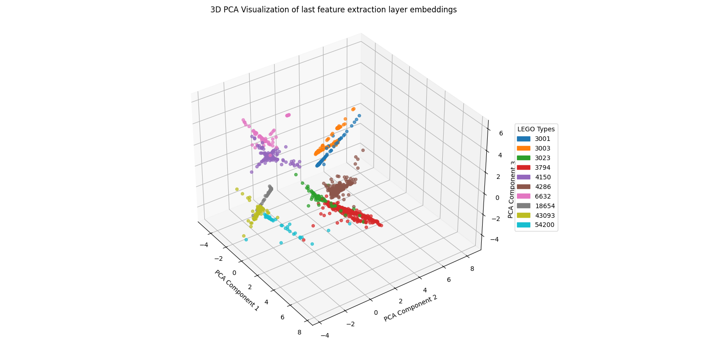

# Machine Learning Final Project

Created **Principal Component Analysis (PCA) Visualization Code** for both **2D and 3D representations** using sklearn's PCA function. 

As learned in class, **PCA is designed to maximize the variance** along any direction d. 
The direction d where the dataset varies the most corresponds to the prinicipcal eigenvector. The second most varying direction corresponds to the eignvector with the second-largest eigenvalue, and so on. 

Using sklearn's PCA function, we can compute the **top *n* principical components** which demonstrate the most important variance in the data.

**PCA on Raw Pixel Values**

When applying PCA to the raw pixel values of images, we analyze patterns of variance in pixel intensities across the dataset. PCA tries to find important structures such as edges, shapes and common pattens that contribute most to the differences between images.

**PCA on Model Embeddings**

We also apply PCA to the embeddings from a trained model. Unlike raw pixel values, these embeddings encode high-level features such as textures, object parts, and important information. By applying PCA to these embeddings, we can visualize the directions of maximum variance in the learned feature space. Thus, this provides insight into how the mdoel differeniates between image categories.

**PCA Visualization using Embeddings**

As seen in the figure, when using the embeddings from the last feature extraction layer of a pretrained MOBILENETV2 model, we observe that the classes are mostly linearly seperable, with some outliers and slight overlap between certain groups. However for the most part, the classes form distinct clusters, which indicates a meaningful seperation between them.
Since the classes are linearly seperable in the PCA space, this implies that they are also linearly serpeable in the raw feature space. Thus, the embeddings effectively capture distingushing features that make it easier to seperate different classes. 

**Sources**

https://scikit-learn.org/stable/modules/decomposition.html#pca